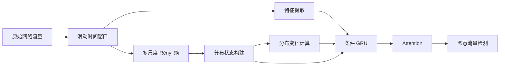

# MSRE-GRU：基于多尺度 Rényi 熵与 GRU 的恶意流量检测模型

## 📄 基本信息

| 项目 | 内容 |
|------|------|
| 论文标题 | MSRE-GRU: Multi-Scale Rényi Entropy and GRU-Based Temporal Model for Malicious Traffic Detection |
| 作者 | Yongshuai Wang, Yaowei Duan, Yichuan Wang, Ruinan Peng, Huigui Yan |
| 研究方向 | 恶意流量检测（MTD）、网络安全、深度学习 |
| 核心技术 | 多尺度 Rényi 熵、GRU、注意力机制 |
| 数据集 | UNSW-NB15、USTC-TFC2016 |
| 关键词 | Malicious Traffic Detection、Rényi Entropy、GRU、Temporal Modeling |

---

# 📜 Research Core（研究核心）

## 研究背景

随着网络攻击日益复杂，恶意流量分布呈现：

- 动态变化（Dynamic Variation）
- 时间演化（Temporal Evolution）
- 非平稳分布（Non-stationary Distribution）

传统熵方法虽然具有：

- 计算开销小
- 可解释性强

但存在：

- 浅层建模
- 泛化能力不足
- 难以刻画细粒度流量分布变化

深度学习方法虽然能学习复杂特征，但缺乏对流量分布变化的显式统计建模。

因此作者提出：

> MSRE-GRU（Multi-Scale Rényi Entropy + GRU）

将统计学分布建模与深度时序建模融合。

---

## 🎯 论文解决的问题

现有方法存在两个关键缺陷：

### 问题1：无法刻画复杂流量分布

传统 Shannon Entropy：

- 只能从单一尺度观察流量
- 对复杂攻击模式敏感度有限

### 问题2：缺少时间演化建模

多数熵方法：

- 使用阈值检测
- 缺少时序关联分析

无法学习：

- 攻击行为的发展过程
- 流量分布随时间的变化规律

---

## 💡 创新点

### 创新1：多尺度 Rényi 熵建模

引入多个阶数 α：

- α < 1：关注低概率事件
- α > 1：关注高概率事件

从多个尺度刻画流量分布。

优势：

- 更全面描述流量结构
- 提升对异常流量敏感度

---

### 创新2：分布演化表示机制

构建：

- 当前窗口状态
- 相邻窗口状态差

用于描述：

```text
Traffic Distribution Evolution
```

实现对流量变化趋势的显式建模。

---

### 创新3：Entropy-Conditioned GRU

改进传统 GRU：

将：

- 流量特征
- 分布状态
- 分布变化量

共同输入 GRU。

使门控机制能够感知流量分布变化。

---

### 创新4：注意力机制融合

通过 Attention：

自动关注：

- 关键时间窗口
- 关键攻击行为

提高检测性能。

---

## 🧩 不足

### 1. 模型较复杂

包含：

- 多尺度熵计算
- 状态映射
- 条件GRU
- Attention

训练成本较高。

### 2. 参数敏感

需要选择：

- Rényi阶数 α
- 时间窗口大小
- 滑动步长

不同场景可能需要重新调参。

### 3. 实时性未充分验证

论文主要在离线数据集测试。

实际高速网络环境表现仍需进一步验证。

---

# 🔁 Research Content（研究内容）

## 💧 数据集

### UNSW-NB15

包含：

- Normal
- DoS
- Exploits
- Fuzzers
- Worms 等攻击流量

特点：

- 现代网络环境
- 多类别攻击

---

### USTC-TFC2016

包含：

- 正常流量
- 恶意软件流量

如：

- Zeus
- Neris
- Virut

适用于恶意流量分类任务。

---

## 👩🏻‍💻 方法

### 整体流程



---

### Step1：时间窗口构建

采用：

```text
Sliding Window
```

作用：

将连续流量转换为：

```text
Window-Level Temporal Features
```

---

### Step2：多尺度 Rényi 熵计算

离散化窗口内特征。

计算多个 α 阶熵值：

```text
α1
α2
α3
...
```

形成：

```text
Multi-scale Distribution Representation
```

---

### Step3：分布状态表示

通过可学习映射：

```text
Entropy Vector
      ↓
Distribution State
```

获得窗口级状态向量。

---

### Step4：分布演化建模

计算：

```text
ΔS(t)=S(t)-S(t-1)
```

描述流量变化趋势。

---

### Step5：条件GRU建模

输入：

```text
Traffic Feature
+ Distribution State
+ State Variation
```

输出：

```text
Temporal Representation
```

---

### Step6：Attention分类

自动聚焦关键时间步。

最终输出：

```text
Normal / Malicious
```

---

# 🔬 实验分析

## 对比模型

论文对比了：

- CNN
- LSTM
- GRU
- Transformer类模型
- 熵特征方法

---

## 实验结果

在：

- UNSW-NB15
- USTC-TFC2016

上均取得最佳或接近最佳结果。

结论：

MSRE-GRU在：

- Accuracy
- Precision
- Recall
- F1

方面表现优于多数基线模型。

---

## 消融实验

验证：

### 仅流量特征

性能下降

### 仅Rényi熵

性能下降

### 联合建模

性能最高

说明：

> 流量特征与熵分布信息具有互补性。

---

# 📜 Conclusion（论文结论）

MSRE-GRU通过：

1. 多尺度 Rényi 熵
2. 分布演化建模
3. 条件GRU
4. 注意力机制

实现：

- 更强的流量分布表示能力
- 更好的时序建模能力
- 更高的恶意流量检测精度

证明统计分布特征与深度学习联合建模具有明显优势。

---

# 🤔 Personal Summary（个人思考）

## 🙋 关键记录

论文本质：

```text
Rényi Entropy
        +
Distribution Evolution
        +
GRU
        +
Attention
```

属于：

```text
统计特征增强的深度学习恶意流量检测
```

---

## 📌 可进一步研究

### 方向1

将GRU替换为：

- Transformer
- Temporal Transformer

---

### 方向2

加入图结构信息：

```text
Entropy + GNN + Transformer
```

---

### 方向3

引入自监督预训练。

提升跨数据集泛化能力。

---

## 💭 启发

该工作说明：

> 深度学习并不能完全替代统计学特征。

在网络安全场景中：

- 熵
- 流量统计量
- 图结构特征

与深度模型融合往往比单纯堆叠网络更有效。
